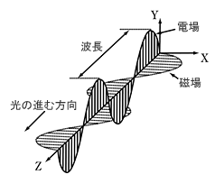
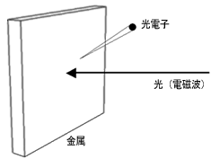
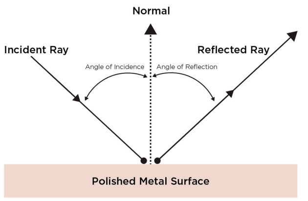
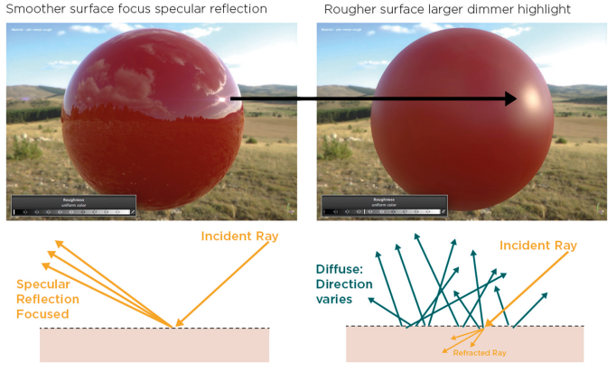
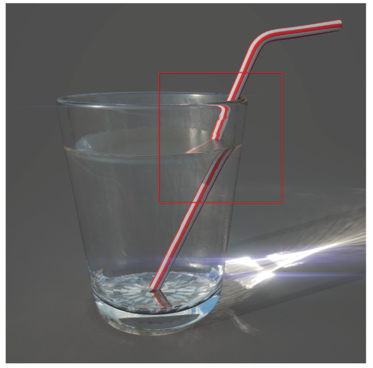
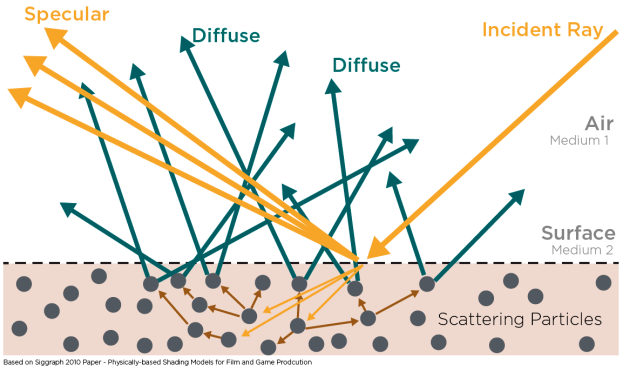
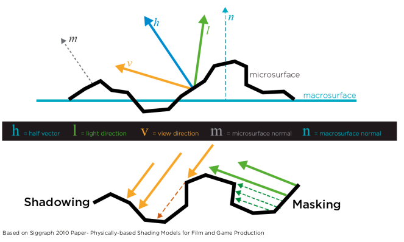
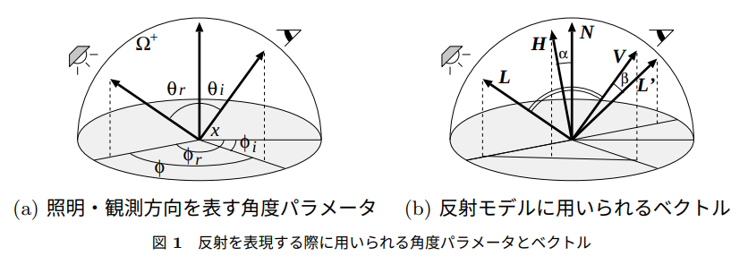

# BSDFの定義と反射率について

光のエネルギーとBSDFの定義と反射率について，引用している記事の内容から学習したことをまとめました．

## 目次

1. [光の性質](#光の性質)        
1. [光の物理量](#光の物理量) 
1. [BSDF](#bsdf)
1. [反射率](#反射率)
1. [レンダリング方程式](#レンダリング方程式)
1. [引用/参考](#引用参考)

## 光の性質

光は``波``と``粒子``の二面性を持つ．

### 電磁波としての光

波として光を捉える場合は，光は電磁波の一種と考える．
電磁波は電場と地場の変化によって作られる波であり，光のエネルギーを放出または伝達する．
この現象を放射と呼ぶ．
真空中を電場と磁場が垂直に絡まり合いながら進行していくものが光である．
電場または磁場の山から山の長さが波長となる．
太陽や電球などの光源から電磁波が発生し，大気中で散乱や吸収されながら進み，物体表面にぶつかって反射が起こる．
光は媒質によって伝搬される．媒質となる物体を媒体と呼ぶ．

[島津製作所の分析計測機器](https://www.an.shimadzu.co.jp/uv/support/lib/uvtalk/uvtalk1/basic.htm)より．

### 粒子としての光

光は粒子としての側面も持つ．粒子的な側面を強調すると，光を``光子``と呼ぶ．
金属に光を当てた時に，金属の表面から電子が飛び出す．この現象を``光電効果``と呼ぶ．
飛び出した電子を光電子と呼ぶ．
強い光を金属に当てても電子は飛び出さないが，波長の短い光を当てると電子が飛び出す．
当てる光の波長を短くすると，飛び出す電子の数は変わらず，電子のエネルギーが大きくなる．
光を強くしていくと，飛び出す電子の数が増え，電子のエネルギーは変化しない．

この現象は，光を波動として捉えると説明ができず，光を粒子として捉えることで説明できる．
つまり，光が粒子として金属に当たり，電子がはじき出されると考えるということである．

[島津製作所の分析計測機器](https://www.an.shimadzu.co.jp/uv/support/lib/uvtalk/uvtalk1/basic.htm)より．

### 光の直進

光を電磁波の一種と捉えると，障害物がなく均一な物体の中を通る限りは直進する．
光の速度は299792458[m/s]である．

### 光の反射

光は金属などの表面で``鏡面反射``する．
この時，反射の法則により完全に平坦な表面上においては，入ってきた光と反射する光の角度が等しくなる(``完全反射``)．
表面に凹凸がある場合は様々な方向に反射される(``乱反射``)．

### 光の屈折

光は通り抜ける物体によって速度が変わる．
そのため，密度の違う物質の境界では屈折する．

### 光の吸収

物質には特定の波長の光を吸収する性質がある．
光が吸収されると多くの場合，そのエネルギーは熱に変わる．
変化した量に応じて光の強さは減衰し，光の色はその波長に応じて吸収された光量だけ変化するが，光線の方向は変わらない．

### 光の散乱

吸収とは光のエネルギーが物質との相互作用によって，他のエネルギーに変わることがある．

### 光のエネルギー

光のもつ物理的なエネルギーは光学において``放射量``と呼ぶ．

人間は光の波長に応じて感度が異なり，波長のち外は色として知覚される．
人間の眼を通した光の量を``測光量``といい，測光学の扱いになる．
測光量の例として，光度(単位は[cd])，照度(単位は[lx]もしくは[lux])，輝度(単位は[cd/m$^2$])などがある．

### 光線

光線がある表面に当たると，以下のいずれかもしくは両方が発生する．

反射：光線が表面で反射し，異なる方向へ進行する．反射の法則に従えば反射角は入射角に等しくなる．

屈折：光線は表面で速度が代わり，屈折して一方の媒体から別の媒体へと通り抜ける．

### 反射

入射光と反射光の関係は下記の通り．

[PBR guide](https://academy.substance3d.com/courses/the-pbr-guide-part-1)より．

### 鏡面反射

物体表面における反射光を鏡面反射光と呼ぶ．
凹凸のない表面にぶつかると，入射角と反射角は同じになる．
一般的な物体は多少凹凸があるため，反射光は鏡面反射方向に拡散し，反射した光はぼやけて見える．
一方，物体表面が滑らかな場合は収束し，反射した光は鮮明になる．

[PBR guide](https://academy.substance3d.com/courses/the-pbr-guide-part-1)より．

### 屈折

光線は表面で速度が代わり，屈折して一方の媒体から別の媒体へと通り抜ける．
この際の速度変化の指標が``屈折率(Index of refraction:IOR)``である．
屈折率の定義は下記の通りである．

$$
n = \dfrac{c}{v} = \sqrt{\dfrac{\epsilon \mu} {\epsilon_0 \mu_0}}
$$

ここで，$\mu$，$\epsilon$はそれぞれ材質の透磁率$[H/m]$と誘電率$[F/m]$である．
$\mu_0$，$\epsilon_0$はそれぞれ真空の透磁率と誘電率である．

下記が光の屈折の例．ストローが曲がって見える．

[PBR guide](https://academy.substance3d.com/courses/the-pbr-guide-part-1)より．

### 拡散反射

光線が別の媒体に入り，その媒体内部で散乱や吸収を起こし，元の媒体に出射される光を拡散反射光と呼ぶ．

[PBR guide](https://academy.substance3d.com/courses/the-pbr-guide-part-1)より．

### 微小面

光線が物体表面にぶつかって反射する方向は，物体表面の凹凸に依存する．
小さな凹凸を微笑面(microfacet)と呼び，微小面の傾きから物体表面の粗さを計算する．
各微小面は完全鏡面反射すると考えることがある．
この考え方では，微小面により光が物体表面に到達する直前や，反射直後に近傍の打ったい表面により遮られる現象が起きる．
この現象をローカルオクリュージョンと呼び，ローカルオクリュージョンはセルフシャドウイングとセルフルマスキングがある．
セルフシャドウイングは光が物体表面に到達するまでの間に物体表面によって遮られる現象である．
セルフマスキングは光が物体表面で反射された後に物体表面から遠ざかる間に遮られる現象である．

[PBR guide](https://academy.substance3d.com/courses/the-pbr-guide-part-1)より．

## 光の物理量

### 放射束

光の基本単位は光子で，放射エネルギー$Q$は，光子が集まったエネルギーである．
このエネルギーを単位時間あたりで表したものが放射束$\phi$である．

$$
\Phi = \frac{\Delta Q}{\Delta d} = \frac{dQ}{dt}
$$

単位は，[W]である．

### 放射照度

放射照度$E$は単位面積あたりの放射束．
ある面積$A$に到達する放射束を$\Phi$とすると，放射照度$E$は次のようになる．

$$
E = \frac{\Phi}{A}
$$

単位は，[W⋅m$^{-2}$]である．

なお，照度を[lux]もしくは[lx]で表すこともある．

### 光度

光度は，単位立体各あたりの

### 立体角

立体角は，方向と光線の角度的な大きさを表す．
立体角の単位はステラジアン[sr]である．
立体角は平面角を３次元に拡張したものと考えることができる．
面角$\theta$は，円上に張られた弧の長さ$l$を円の半径 $r$で割ったものである．

$$
\theta = \frac{l}{r}
$$

これを３次元で考えると，半径$r$の球面上の面積$A$に対応する立体角$\omega$は$\omega = A/r^2$となる．

[基礎からはじめる物理ベースレンダリング](https://qiita.com/mebiusbox2/items/e7063c5dfe1424e0d01a)より．

### 放射強度

放射強度$I$は，単位立体角（$\omega$）あたりの放射束である．

$$
I(\vec{\omega}) = \frac{d \Phi}{d \vec{\omega}}
$$

単位は，[W⋅sr$^{-1}$〕である．
放射強度は一定の方向に，どの程度の放射束が放出されているのかを表す．

### 放射輝度

放射輝度$L$は，単位立体角あたり，単位投影面積あたりの放射束である．
単位投影面積$\cos\theta dA$は，光が進む方向に直交する面へ単位面積を投影したもので，放射輝度はこの単位投影面積で放射強度を割った値である．
ここでは，物体の位置$x$における放射輝度$L(x,\vec{\omega}_i)$を考える．

$$
L(x,\vec{\omega}_i) = \frac{d^2 \Phi}{\cos \theta dA d \vec{\omega}_i}
$$

単位は，[W⋅sr$^{-1}$ ⋅m $^{-2}$]である．

[基礎からはじめる物理ベースレンダリング](https://qiita.com/mebiusbox2/items/e7063c5dfe1424e0d01a)より．

物体表面における入射してくる放射輝度がわかっていれば，半球面上のすべての方向 $\Omega$と物体表面の領域$A$ で積分することにより，放射束を計算することができる．

$$
\Phi = \int_{A} \int_{\Omega_i} L(x,\vec{\omega_i})(\vec{\omega_i} \cdot \vec{n}) d \vec{\omega_i} dx
$$

## BSDF

ここでは，BSDF(双方向散乱分布関数)について説明する．

### BRDF

物体表面における透過現象のモデル化として，双方向反射率分布関数（bidirectional reflectance distribution function：BRDF）がある．
なお，BRDFを空間的な位置毎に扱う場合は，SVBRDF(Spatially varing BRDF)と呼ぶ．

BRDF$f_{r}$は，反射される放射輝度と放射照度の関係を以下のように定義する．

$$
f_{r}(x,\vec{\omega_i},\vec{\omega_o}) = \frac{dL_{r}(x,\vec{\omega_o})}{dE_{i}(x,\vec{\omega_i})} = \frac{dL_{r}(x,\vec{\omega_o})}{L_{i}(x,\vec{\omega_i})(\vec{\omega_i} \cdot \vec{n}) d \vec{\omega_i}}
$$

BRDFは，点$x$に$\vec{\omega_i}$ 方向から入射した光のどれだけが，$\vec{\omega_o}$方向に反射されるかを表す割合．
単位は[sr$^{-1}$]である．
BRDFでは，入射方向を実際の光の向きとは逆向きに定義する．

物体表面上のある位置に入射する放射輝度がわかっていれば，それがあらゆる方向に反射していく放射輝度を計算することができる．
これは，入射する放射輝度 $L_{i}$ を積分することによって求められる．

$$
L_{r}(x,\vec{\omega_o}) = \int_{\Omega}f_{r}(x,\vec{\omega_i},\vec{\omega_o})dE(x,\vec{\omega_i}) = \int_{\Omega}f_{r}(x,\vec{\omega_i},\vec{\omega_o})L_{i}(x,\vec{\omega_i})(\vec{\omega_i} \cdot \vec{n}) d \vec{\omega_o}
$$

#### BRDFの相反性

光が進む方向に依存しないというヘルムホルツの相反性の法則を満たしている必要がる．
光が入射する方向と出射する方向が入れ替わってもBRDFの結果は変わらない．

$$
f_{r}(x,\vec{\omega_i},\vec{\omega_o}) = f_{r}(x,\vec{\omega_o},\vec{\omega_i})
$$

#### BRDFの エネルギー保存則

物体表面は，それが受けた以上の光を反射することはできず，以下の式を満たさなければない．

$$
\int_{\Omega} f_{r}(x,\vec{\omega_i},\vec{\omega_o})(\vec{\omega_i} \cdot \vec{n}) d \vec{\omega_i} \leq 1, \forall \vec{\omega_i} \in \Omega
$$

## BTDF

物体表面における透過現象のモデル化としてBidirectional Transmittance Distribution Function (BTDF, 双方向透過率分布関数)が考えられる．
これはBRDFの透過版であり，透過する放射輝度$dL_t$を用いて下記のように表される．

$$
f_t(x, \vec{\omega_i}, \vec{\omega_o}) = \frac{dL_t(x,\vec{\omega_o})}{dE_i(\vec{x}, \vec{\omega_i})}
$$

単位は[sr$^{-1}$]である．

このBRDFが相反性を持つのに対して，BTDFはヘルムホルツの相反性を持たない．
屈折率の高い物質に光が半球上の全方向から入射することを考えた場合，それらの光は界面を挟んで反対側では半球よりも小さな範囲へと透過する．
そのため明らかに光の密度、つまり放射輝度に変化が生じる．
これより透過の場合には入射方向，出射方向を入れ替えても相反性が成り立たない．
そこで，入射側と出射側の屈折率をそれぞれ$\eta_i$, $\eta_o$で表すとBTDFは次の関係を持ちます

$$
\frac{f_t(x, \vec{\omega_i}, \vec{\omega_o})}{\eta_o^2} = \frac{f_t(x, \vec{\omega_o}, \vec{\omega_i})}{\eta_i^2}
$$

エネルギー保存則については，BRDFと同様である．

### BSDF

BRDFとBTDF両方を合わせたものをBidirectional Scattering Distribution Function (BSDF, 双方向散乱分布関数)と呼ぶ．

$$
f_s(x, \vec{\omega_i}, \vec{\omega_o}) = f_r(x, \vec{\omega_i}, \vec{\omega_o}) +f_t(x, \vec{\omega_i}, \vec{\omega_o}) 
$$

## 反射率

物体の位置$x$における反射率の定義は，物体表面に入射する放射束と反射される放射束の比で表す．
反射率は0~1の値になる．

$$
\rho(x) = \dfrac{d\phi_r(x)}{d\phi_i(x)}
$$

これを各波長毎に算出することで，分光反射率を求めることができる．

### BRDFを元にした反射率

物体の位置$x$での微小面積$dA$に立体角$\vec{\omega_i}$の範囲を通過して光が入射するとき入射する放射束$d\phi_i$は次の式で表すことができる。

$$
d\phi_i(x) = dA \cdot \int_{\omega_i} L_i(x, \vec{\omega_i}) |\vec{\omega_i} \cdot \vec{n}|  d\vec{\omega_i}
$$

反射する放射束のうち立体角$\vec{\omega_o}$を通過する量$d\phi_r$は次の式で表すことができる．

$$
d\phi_r(x) = dA \cdot \int_{\omega_o} L_r(x, \vec{\omega_o}) |\vec{\omega_o} \cdot \vec{n}|  d\vec{\omega_o}
$$

位置$x$における入射する放射輝度$L_i(\vec{\omega_i})$とBRDF$f_{r}(x,\vec{\omega_i},\vec{\omega_o})$を使うと，反射する放射束は下記のように表すことができる．

$$
d\phi_r(x) = dA \cdot \int_{\omega_o} \int_{\omega_i} f_{r}(x,\vec{\omega_i},\vec{\omega_o}) L_i(x, \vec{\omega_i}) |\vec{\omega_i} \cdot \vec{n}| d\vec{\omega_i} |\vec{\omega_o} \cdot \vec{n}| d\vec{\omega_o}
$$

以上のことから，一般的な反射率は，立体角$\vec{\omega_i}$の範囲を通過した光が，物体における位置$x$で反射し，立体角$\vec{\omega_o}$を通過するものとして，下記の式で表すことができる．

$$
\rho(x,\vec{\omega_i}, \vec{\omega_o},L_i) = \frac{\int_{\omega_o} \int_{\omega_i} f_{r}(x,\vec{\omega_i},\vec{\omega_o}) L_i(x, \vec{\omega_i}) |\vec{\omega_i} \cdot \vec{n}| d\vec{\omega_i} |\vec{\omega_o} \cdot \vec{n}| d\vec{\omega_o}}{\int_{\omega_i} L_i(x, \vec{\omega_i}) |\vec{\omega_i} \cdot \vec{n}|  d\vec{\omega_i}}
$$

この式により，任意の入射光・出射光の形状，任意の入射放射輝度分布の組み合わせに対する一般的な反射率を表すことができる．

### 角度パラメータ

ここでは，ベクトル$\vec{\omega_i}$，$\vec{\omega_o}$で方向を表している．
しかし一般的には，４つのパラメータで表すこともある．

[反射・散乱の計測とモデル化](http://omilab.naist.jp/~mukaigawa/papers/CVIM2010-Tutorial.pdf)より．

上記のように４つの角度パラメータにおける，各波長のBRDFの値を表すフォーマットとして，[ASTM](http://www.graphics.cornell.edu/online/measurements/reflectance/index.html)のフォーマットがある．

ベクトル$\vec{\omega_i}$，$\vec{\omega_o}$それぞれに角度パラメータ$\theta_i$,$\phi_i$,と$\theta_o$,$\phi_o$を定義すると，3次元直交座標におけるそれぞれのベクトルを行列にして下記のように表すことができる．

$$
\boldsymbol{\omega}_i =\left[ 
\begin{matrix} 
sin\theta_i cos\phi_i, \\ 
sin\theta_i sin\phi_i, \\
cos\theta_i \\
\end{matrix}
\right]
$$

$$
\boldsymbol{\omega}_o =\left[ 
\begin{matrix} 
sin\theta_o cos\phi_o, \\ 
sin\theta_o sin\phi_o, \\
cos\theta_o \\
\end{matrix}
\right]
$$

物体の法線$\vec{n}$の行列も同様に表現する．

$$
\boldsymbol{n} = \left[ 
\begin{matrix} 
sin\theta_n cos\phi_n, \\ 
sin\theta_n sin\phi_n, \\
cos\theta_n \\
\end{matrix}
\right]
$$

### 角度パラメータによる反射率の表現

この角度パラメータを使い，反射率を表現する．
反射率を表す式における内積を，角度パラメータで表す．

$$
\vec{\omega_i} \cdot \vec{n} = \boldsymbol{\omega}_i^T \cdot \boldsymbol{n} = sin\theta_i cos\phi_i sin\theta_n cos\phi_n + sin\theta_i sin\phi_i sin\theta_n sin\phi_n  + cos\theta_i cos\theta_n 
$$

$$
\vec{\omega_o} \cdot \vec{n} = \boldsymbol{\omega}_o^T \cdot \boldsymbol{n} = sin\theta_o cos\phi_o sin\theta_n cos\phi_n + sin\theta_o sin\phi_o sin\theta_n sin\phi_n  + cos\theta_o cos\theta_n 
$$

ここで，物体の法線$\vec{n}$がz方向のみ(完全に平面な物体)と想定すると，下記のようになる．

$$
\boldsymbol{n} = \left[ 
\begin{matrix} 
0, \\ 
0, \\
1 \\
\end{matrix}
\right]
$$

$$
\vec{\omega_i} \cdot \vec{n} = cos\theta_i
$$

$$
\vec{\omega_o} \cdot \vec{n} = cos\theta_o
$$

上記の式を使用して，反射率を表す．

$$
\rho(x,\vec{\omega_i}, \vec{\omega_o}, L_i) = \frac{\int_{\omega_o} \int_{\omega_i} f_{r}(x,\vec{\omega_i},\vec{\omega_o}) L_i(x, \vec{\omega_i}) |cos\theta_i| d\vec{\omega_i} |cos\theta_o| d\vec{\omega_o}}{\int_{\omega_i} L_i(x, \vec{\omega_i}) |cos\theta_i|  d\vec{\omega_i}}
$$

また，入射する放射輝度$L_i(x, \vec{\omega_i})$の分布が等方的である場合は上式は次のようになる．

$$
\rho(x,\vec{\omega_i}, \vec{\omega_o}) = \frac{\int_{\omega_o} \int_{\omega_i} f_{r}(x,\vec{\omega_i},\vec{\omega_o})|cos\theta_i| d\vec{\omega_i} |cos\theta_o| d\vec{\omega_o}}{\int_{\omega_i} |cos\theta_i|  d\vec{\omega_i}}
$$

例えば，入射光はある一方向，とした場合の反射率は，上の式において入射光を切り取る立体角を$d\vec{\omega_i}$，出射光を切り取る立体角を$\Omega$とした場合に相当し，下記のようになる．

$$
\rho(x,\vec{\omega_i}, \vec{\omega_o}) = |\vec{\omega_i} \cdot \vec{n}| d\vec{\omega_i} \frac{\int_{\Omega} f_{r}(x,\vec{\omega_i},\vec{\omega_o}) |cos\theta_o| d\vec{\omega_o}}{|\vec{\omega_i} \cdot \vec{n}| d\vec{\omega_i}} = \int_{\Omega} f_{r}(x,\vec{\omega_i},\vec{\omega_o}) |cos\theta_o| d\vec{\omega_o}
$$

出射光を切り取る立体角$\Omega$を半球全てとした場合，鏡面反射光と拡散反射光を合わせた全光線反射光で反射率を定義することになる．
出射光を切り取る立体角$\Omega$を鏡面反射する立体角とした場合，鏡面反射光における反射率となる．
出射光を切り取る立体角$\Omega$を拡散反射する立体角とした場合，拡散反射光における反射率となる．
現実では，物体表面には粗さがあるため，鏡面反射方向に拡散する（拡がりを持つ）点を考慮しなければならない．

分光反射率を求める際などは，拡散反射光で測定することが一般的である．

## レンダリング方程式

位置$x$から出射する光は，表面から放射される光と反射される光の和で求められる．

．．．

今後追加予定．

BRDFのモデルも代表的なものは勉強したい．

## 引用/参考

[島津製作所の分析計測機器](https://www.an.shimadzu.co.jp/uv/support/lib/uvtalk/uvtalk1/basic.htm)

[基礎からはじめる物理ベースレンダリング](https://qiita.com/mebiusbox2/items/e7063c5dfe1424e0d01a)

[PBR guide](https://academy.substance3d.com/courses/the-pbr-guide-part-1)

[双方向(反射率|透過率|散乱)分布関数 (B(R|T|S)DF)](https://rayspace.xyz/CG/contents/BRDF_BTDF_BSDF/)

[反射・散乱の計測とモデル化](http://omilab.naist.jp/~mukaigawa/papers/CVIM2010-Tutorial.pdf)

[Reflectance Data by Cornell Univ.](http://www.graphics.cornell.edu/online/measurements/reflectance/index.html)